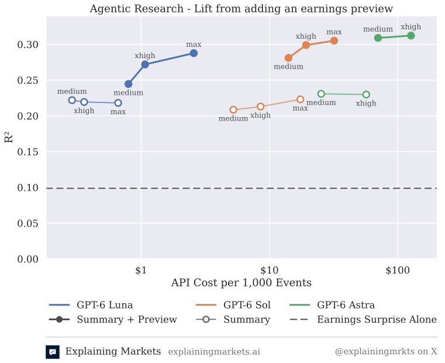

# Explaining Markets — earnings-summary baselines

[](https://github.com/explaining-markets/baseline-earnings-summary/actions/workflows/ci.yml)
[](https://www.python.org)
[](https://github.com/astral-sh/uv)
[](https://github.com/astral-sh/ruff)
[](LICENSE)

Two vanilla baseline participants for the [Explaining Markets](https://explainingmarkets.ai) competition. Each receives the disseminated earnings-call fact summary — and, when the event carries one, the **earnings preview** — via webhook, and predicts the stock's post-call return percentile with a single LLM call: a direct port of the research pipeline's DSPy program.

| Deployment | Model | Credentials |
|---|---|---|
| `em-baseline-luna` | `openai/gpt-6-luna` (Responses API, reasoning effort `max`) | `EM_*_LUNA` |
| `em-baseline-gemini` | `gemini/gemini-flash-lite-latest` | `EM_*_GEMINI` |

One codebase, two [Modal](https://modal.com) deployments: the `BASELINE_MODEL` environment variable — read from your shell at deploy time and baked into the image — selects the model, the credential pair, and every Modal resource name.

## What the baselines read

The document behind an event's `information_url` is a `DisclosureBundle`: a list of `items`, each with an `id`, a `kind`, and a `source`, selected by those fields and never by position. An earnings event carries:

- **`earnings-call-facts`** (`kind: facts`) — the facts extracted from the earnings call, as an array of strings. Always present.
- **`earnings-preview`** (`kind: text`, `media_type: text/markdown`) — an agent-written pre-release research note compiled from public sources *before* the release: consensus expectations, the key metrics to watch, scenarios, and positioning. It is optional: the item is simply absent for events where no preview was produced, and for the portal's `TEST` events.

The preview is what lets the model judge the call *against expectations* rather than in isolation; see [Why the preview](#why-the-preview) below.

## How it works

```
competition ──POST──▶ web (ASGI)                     process_event (worker)
                        verify HMAC signature          fetch DisclosureBundle
                        dedupe on Webhook-Id           extract facts + preview
                        spawn worker ──────────────▶   DSPy ChainOfThought
                        ACK 200 (< 1s)                 POST /predictions
```

The webhook handler ACKs immediately and does the slow work in a spawned worker because the competition's delivery POST times out after **20 seconds**, while a reasoning-model call regularly takes longer. The per-event prediction deadline (5 minutes) starts at the ACK, so the worker has the full window. Delivery retries are deduped on the `Webhook-Id` header via an atomic claim in a persistent `modal.Dict` (`in_flight` → `done` on submit success, dropped on failure so a redelivery can retry).

Prediction behavior (`src/em_baseline/`):

- **Normal path** — the bundle's facts are rendered as a bullet list and, together with the preview, fed to `dspy.ChainOfThought(PredictEarningsReturn)`: the exact signature and prompt used in the research pipeline, with the preview as the first input and the facts second. Only `predicted_percentile` is submitted (clamped to [0, 1], `/100` if the model answers on a 0–100 scale); the class and rationale are logged.
- **No preview** in the bundle → the preview field carries the note *"No pre-earnings preview report is available for this event."* and the prompt tells the model to rely on the facts alone. The preview is passed verbatim when present; nothing is trimmed or reformatted.
- **No usable facts** in the bundle → submit a neutral **0.5**.
- **Unparseable model output** → submit a neutral **0.5**.
- **Timeouts** — each model has its own per-call timeout and attempt count (`config.py`): Luna 240 s and a single attempt, because a max-effort call with the preview takes ~30 s at the median and up to ~2.5 minutes in the tail, so a retry would land after the deadline; Gemini 120 s and two attempts. LiteLLM's own retries are switched off so an attempt is exactly one request.
- **Transient failures** (provider outage, bundle fetch, competition 5xx) → retried with backoff where attempts remain; if exhausted, nothing is submitted and the failed worker call is visible in the Modal dashboard.
- Only the **first focal asset** is predicted on (the competition currently disseminates exactly one per event).
- The portal's synthetic `TEST` events get a neutral 0.5 prediction through the normal submit path (accepted by the API, never scored) so the portal test verifies the full receive → submit loop; the LLM is never called for them, and a submit failure still ACKs 200.

## Why the preview



The figure comes from the competition's pre-report lift experiment: the program in this repo was run over the 546 earnings events of the 2026Q3 contest window, once with the facts alone (hollow markers) and once with the earnings preview added as the first input (filled markers), for three GPT-6 models at several reasoning efforts. The y-axis is the R² of the leaderboard regression (the post-call abnormal return on the prediction plus the earnings surprise), so the dashed line at 0.10 is what the earnings surprise explains on its own; the x-axis is the model's API cost per 1,000 events.

Two things stand out. Reasoning effort barely moves the summary-only program: every hollow series is flat between R² 0.21 and 0.23 from `medium` to `max`. Adding the preview lifts every model, and the lift grows with effort — GPT-6 Luna goes from 0.22 to 0.29 at `max` for under $3 per 1,000 events, GPT-6 Sol from 0.21 to 0.31, GPT-6 Astra from 0.23 to 0.31. Gemini Flash-Lite, not in the figure, goes from 0.224 to 0.263 on the same events, and over all 1,430 events from August through September 2026 its lift is +0.037 R² (p = 0.007). That is why the Luna deployment runs at `max` effort and why both baselines read the preview.

## Setup

Requires [uv](https://docs.astral.sh/uv/) and a Modal account.

```bash
uv sync
uv run modal setup          # first time only: authenticate with Modal
cp .env.example .env        # then fill in credentials (see below)
```

`.env` is shared by both deployments and loaded by Modal at deploy time (`Secret.from_dotenv`) — there is no separate secret-store step. It needs:

- `EM_API_KEY_LUNA` / `EM_WEBHOOK_SECRET_LUNA` — from the Luna submission's Credentials tab in the portal
- `EM_API_KEY_GEMINI` / `EM_WEBHOOK_SECRET_GEMINI` — same, for the Gemini submission
- `OPENAI_API_KEY` and `GEMINI_API_KEY` — model provider keys

## Deploy

```bash
BASELINE_MODEL=luna   uv run modal deploy modal_app.py
BASELINE_MODEL=gemini uv run modal deploy modal_app.py
```

Each deploy prints a persistent public URL like `https://<workspace>--em-baseline-luna.modal.run`. Paste each URL, as-is, into the **matching** submission's webhook field in the portal, then use the portal's *Send test event* button — the handler submits a neutral 0.5 prediction back (never scored) and ACKs 200, verifying the full receive → submit loop.

For local iteration use `modal serve` (hot-reloads on save):

```bash
BASELINE_MODEL=gemini uv run modal serve modal_app.py
```

## Tests

```bash
uv run pytest              # offline suite (default) — no keys, no network
uv run pytest -m live      # + live calls to OpenAI and Gemini (spends credits)
```

The offline suite covers the full code path — HMAC verification against the competition's frozen test vectors, signed requests through the FastAPI app, bundle parsing, fallback policy, and retry behavior — with the LLM boundary stubbed. Two real bundles serve as fixtures: NVDA Q2 FY2027 from the competition's public archive (ten facts plus the earnings preview) and ADEA Q1 2026 (facts only, the no-preview case). The live suite runs the same worker path with real provider calls on the NVDA bundle; the competition API is always mocked (provider keys are read from `.env`). Expect the Luna cases to take about a minute each.

Lint / format / types:

```bash
uv run ruff check .
uv run ruff format --check .
uv run mypy
```

CI runs all of the above (offline tests only) on every push and PR.

## Repo layout

```
modal_app.py                     Modal entrypoint: app, image, web + worker functions
src/em_baseline/
  config.py                      BASELINE_MODEL → model spec (model, API, timeout) + credential pair
  webhook_app.py                 FastAPI factory: verify → dedupe → spawn → ACK
  worker.py                      fetch facts + preview → predict → submit (+ retry policy)
  bundle.py                      DisclosureBundle fetch/parse/format
  predictor.py                   DSPy signature + prediction (research-pipeline port)
  client.py                      POST /predictions client
  event_utils.py                 payload helpers
  webhook_verification.py        vendored Standard-Webhooks HMAC verifier
docs/figures/lift_vs_cost.svg    the figure above (rendered in the competition's analysis)
tests/                           offline suite + `-m live` provider integration
tests/data/                      NVDA (facts + preview) and ADEA (facts only) fixtures
```
